# Money Laundering Analysis

## Introducción

El blanqueo de capital, también conocido como lavado de activos, consiste en introducir en el sistema financiero legítimo bienes o dinero provenientes de actividades ilícitas, con el objetivo de disimular su origen. En el contexto de las redes digitales de pagos, esta práctica se manifiesta a través de patrones de transferencias específicos y recurrentes que buscan ofuscar los circuitos de movimiento de dinero.

## Objetivo

El objetivo de este trabajo práctico es diseñar e implementar un **sistema distribuido** capaz de analizar un volumen masivo de transacciones bancarias en busca de anomalías y patrones asociados al lavado de activos. El sistema debe estar optimizado para entornos multicomputadoras, soportar el incremento de nodos de cómputo para escalar horizontalmente, e incorporar un middleware propio para abstraer la comunicación basada en grupos. Asimismo, debe soportar una única ejecución del procesamiento y manejar el apagado graceful ante señales SIGTERM.

## Dataset

El sistema trabaja sobre el dataset público de IBM de transacciones financieras para detección de lavado de activos anti-money laundering (AML), disponible en Kaggle. El dataset consta de dos archivos principales:

### Transacciones
Cada fila representa una transacción entre dos cuentas bancarias. Los campos relevantes son:

| Campo | Descripción |
|---|---|
| `Timestamp` | Fecha y hora de la transacción (`YYYY/MM/DD HH:MM`) |
| `From Bank` | ID numérico del banco de origen |
| `Account` | Número de cuenta de origen |
| `To Bank` | ID numérico del banco de destino |
| `Account.1` | Número de cuenta de destino |
| `Amount Received` | Monto recibido por la cuenta destino |
| `Receiving Currency` | Moneda en que se recibe el monto |
| `Amount Paid` | Monto pagado por la cuenta de origen |
| `Payment Currency` | Moneda en que se realiza el pago |
| `Payment Format` | Formato del pago: `Wire`, `ACH`, `Cheque`, `Bitcoin`, etc. |
| `Is Laundering` | Indicador binario (0/1) de si la transacción es fraudulenta |

### Cuentas

Contiene información sobre las entidades bancarias y sus cuentas. Los campos son:

| Campo | Descripción |
|---|---|
| `Bank Name` | Nombre del banco |
| `Bank ID` | Identificador numérico del banco |
| `Account Number` | Número de cuenta |
| `Entity ID` | Identificador de la entidad propietaria |
| `Entity Name` | Nombre de la entidad |

## Queries a resolver

El sistema debe calcular los siguientes resultados a partir del dataset:

### Query 1 — Transacciones USD menores a $50

Obtener la **cuenta de origen, cuenta de destino y monto** de todas las transacciones realizadas en USD cuyo monto sea inferior a 50 USD.

**Campos involucrados**: `From Bank`, `Account`, `To Bank`, `Account.1`, `Amount Paid`, `Payment Currency`

### Query 2 — Transacción máxima por banco

Para cada banco de origen, obtener el **nombre del banco, la cuenta de origen y el monto** correspondiente a la transacción USD de mayor valor registrada. Requiere hacer un join entre el dataset de transacciones y el de cuentas para resolver el nombre del banco a partir del `Bank ID`.

**Campos involucrados**: `From Bank`, `Account`, `Amount Paid`, `Payment Currency` (transacciones) + `Bank ID`, `Bank Name` (cuentas)

### Query 3 — Transacciones anómalas por formato de pago

Obtener la **cuenta de origen y monto** de las transacciones USD en el período **[2022-09-06, 2022-09-15]** cuyo monto sea menor al **1% del promedio** registrado para el mismo formato de pago en el período **[2022-09-01, 2022-09-05]**.

Las transacciones del período posterior se almacenan mientras se calcula el promedio del período base; una vez disponible, se aplica el filtro sobre las almacenadas.

**Campos involucrados**: `From Bank`, `Account`, `Payment Format`, `Amount Paid`, `Payment Currency`, `Timestamp`

### Query 4 — Detección del patrón Scatter-Gather

El patrón **scatter-gather** consiste en que una cuenta de origen distribuye fondos hacia múltiples cuentas intermediarias (fan-out), y estas luego concentran el dinero en una única cuenta destino distinta (fan-in), dificultando así la trazabilidad del flujo de dinero.

Esta query identifica los pares de cuentas **(origen, destino)** que cumplen dicho patrón con una sola cuenta de separación.

El filtro se aplica sobre transacciones USD del período **[2022-09-01, 2022-09-05]**, considerando únicamente cuentas de origen que hayan transferido a **al menos 5 cuentas intermedias distintas** en dicho período.

**Campos involucrados**: `From Bank`, `Account`, `To Bank`, `Account.1`, `Payment Currency`, `Timestamp`

### Query 5 — Conteo de transacciones Wire/ACH

Contar el total de transacciones del período **[2022-09-01, 2022-09-05]** con formato de pago **Wire** o **ACH** cuyo monto, **convertido a USD**, sea menor a 1 dólar. 

**Campos involucrados**: `Timestamp`, `Payment Format`, `Amount Paid`, `Payment Currency`

## Arquitectura

### Vista de Casos de Uso

El diagrama muestra el único actor del sistema, el **Cliente**, y su interacción principal: solicitar el análisis de transacciones. Esa acción incluye las cinco queries del sistema.

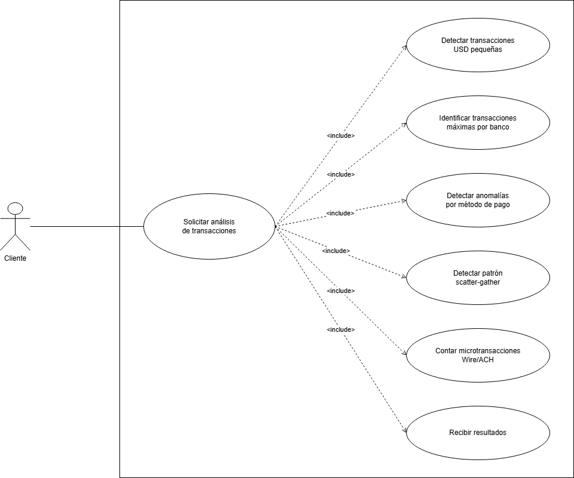

### Vista Lógica

#### DAG

A continuación se presenta el DAG del sistema, que representa el flujo general de procesamiento de los datos. Desde `Data source` las transacciones se distribuyen por dos ramas principales: la rama `usd`, que filtra por moneda de origen, y la rama `*`, que recibe todas las transacciones independientemente de su moneda. Los datos van pasando por distintos nodos de procesamiento, filtrado, agregación, mapeo, entre otros; cuyos colores en el diagrama indican el tipo de operación que realizan. Cabe destacar que algunos nodos son compartidos entre múltiples queries, como el `DateFilter`, utilizado por Q3, Q4 y Q5. Finalmente, los resultados de cada consulta llegan a su reducer correspondiente.

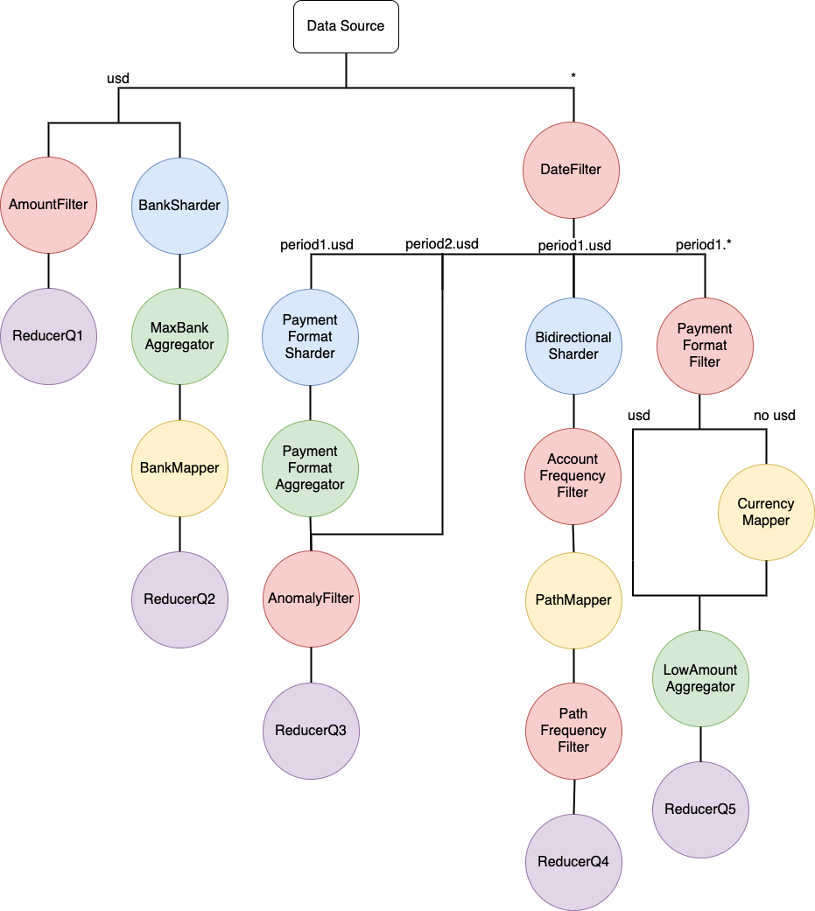

### Vista de Procesos

#### Diagramas de Actividades

A continuación se presentan los diagramas de actividades que modelan el flujo de ejecución para cada una de las cinco consultas. Estos esquemas ilustran de manera secuencial cómo transitan los mensajes a través de la topología del sistema distribuido. En ellos se detallan las distintas etapas del pipeline de procesamiento de datos, mostrando la interacción entre los nodos encargados de filtrar, rutear, transformar y agregar la información hasta llegar a la consolidación y envío del resultado final.

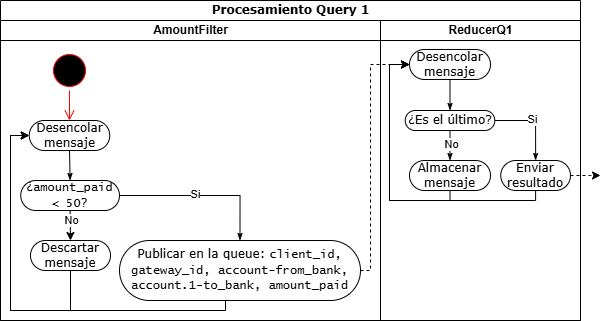

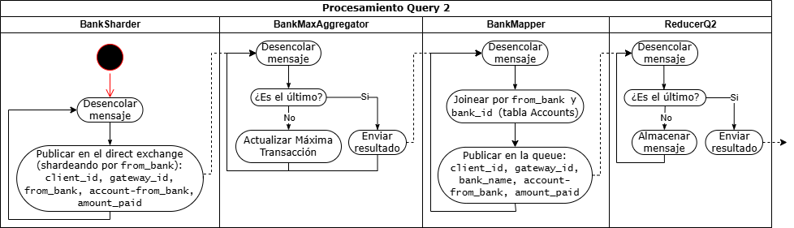

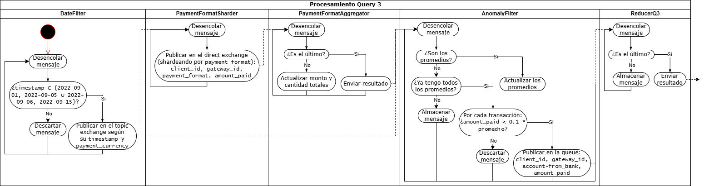

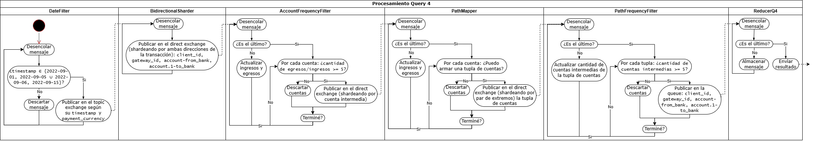

### Diagrama de Flujo de Finalización (EOF/FIN)

El siguiente diagrama ilustra el protocolo de sincronización y cierre de procesamiento dentro del sistema distribuido. Detalla la lógica general que ejecuta cualquier nodo de la topología al recibir un mensaje que indica el fin de un flujo de datos (EOF/FIN). El esquema diferencia el comportamiento entre los nodos que mantienen estado interno (*stateful*) y aquellos sin estado (*stateless*). De esta manera, se visualiza cómo se coordinan las barreras de sincronización establecidas a partir de la contabilización exacta de los mensajes procesados y esperados para garantizar la correcta consolidación del resultado, lo que permite realizar el flush de los datos acumulados de forma segura y propagar en cascada la señal de finalización a lo largo del pipeline.

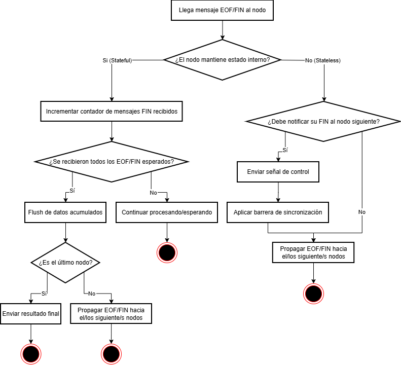

### Diagrama de Secuencia

El siguiente diagrama de secuencia expone la interacción general entre el cliente y los componentes de entrada y procesamiento del sistema distribuido. Se detalla el flujo de ingesta de datos, donde las transacciones son enviadas en lotes (*batches*) hacia un balanceador de carga que las rutea al `Gateway` correspondiente. Asimismo, ilustra la delegación de las transacciones individuales hacia los `Workers` para su procesamiento parcial, culminando con la inyección de la señal de fin de transmisión (EOF). Esta señal marca el inicio de la etapa de procesamiento final y consolidación, permitiendo el retorno de los resultados calculados a través de la topología de vuelta hacia el cliente.

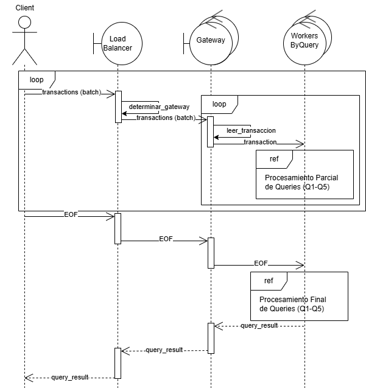

### Vista de Desarrollo

#### Diagrama de Paquetes

El diagrama de paquetes muestra la organización modular de los componentes del sistema. 

El paquete **worker** representa de manera unificada a todos los nodos de procesamiento del pipeline (filtros, sharders, mappers, aggregators y reducers). Aunque cada uno tiene su lógica propia, comparten una misma estructura base (entrada desde el broker, procesamiento, salida al broker) por lo que se modelan como un único paquete para mantener el diagrama legible.

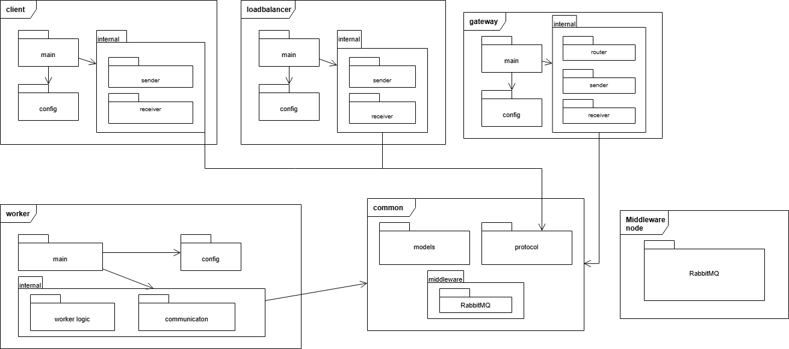

### Vista Física

#### Diagrama de Robustez

El diagrama que se encuentra a continuación muestra los componentes principales del sistema y sus interacciones. El **Client** envía las transacciones al sistema y recibe los resultados al finalizar el procesamiento. Las transacciones ingresan a través del **Load Balancer**, que las redirige a uno de los nodos **Gateway** disponibles, siendo estos los encargados de distribuirlas hacia el procesamiento de cada query.

Para balancear la carga entre múltiples instancias del **Gateway** se planea emplear **HAProxy** como implementación del **Load Balancer**. Este componente cuenta con un único nodo, lo que introduce un punto único de falla. Si bien esto representa una limitación en términos de disponibilidad, se optó por esta simplicidad dado el alcance del sistema. 

Los nodos del sistema (filtros, aggregators, mappers, entre otros) se comunican entre sí a través de **exchanges y queues**, donde los exchanges permiten enrutar cada mensaje al nodo correspondiente según corresponda. Un caso particular es el **AnomalyFilter**, que requiere almacenamiento temporario en disco para retener las transacciones del período posterior mientras se calcula el promedio del período base, necesario para la Query 3. Finalmente, los **reducers** consolidan los resultados de cada query y los publican en el exchange para que lleguen al Gateway correspondiente.

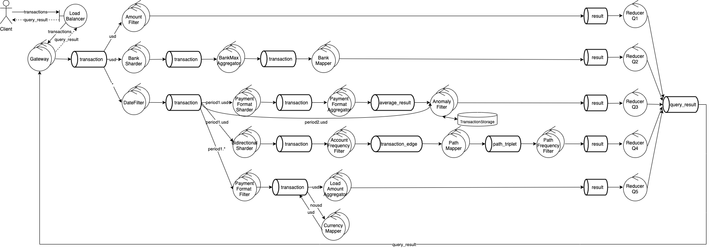

#### Diagrama de Despliegue

El diagrama de despliegue muestra cómo los distintos procesos del sistema se distribuyen en nodos de ejecución. Las lineas represetan la comunicación entre nodos.

El sistema se organiza alrededor del **Broker Node** (RabbitMQ), que actúa como hub central de mensajería: todos los nodos de procesamiento se comunican entre sí exclusivamente a través de él. Las únicas conexiones por fuera del broker son las TCP entre el **Client PC** y el **Load Balancer Node**, y entre este último y los **Gateway Nodes**.

Los nodos de procesamiento se agrupan por rol funcional (**Filter Node**, **Sharder Node**, **Mapper Node**, **Aggregator Node**, **Reducer Node**). Cada uno de estos agrupamientos contiene múltiples implementaciones concretas con lógicas distintas (por ejemplo, el Filter Node engloba tanto el filtro por monto como el de fecha y el detector de anomalías). Se eligió agruparlos así para mantener el diagrama mas simple y legible, evitando mostrar cada nodo individualmente.

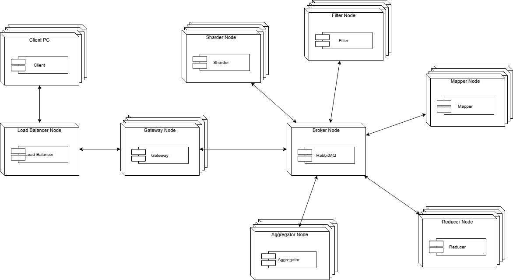

## División tentativa de tareas

| Tarea | Integrante |
|---|---|
| Query 1 | Luciana |
| Query 2 | Bautista |
| Query 3 | Bautista |
| Query 4 | Carolina |
| Query 5 | Carolina |
| Middleware | Bautista |
| Server | Luciana |
| Cliente | Luciana |
