# TP Sistemas Distribuidos: Money Laundering Analysis

## Introducción

El blanqueo de capital, también conocido como lavado de activos, consiste en introducir en el sistema financiero legítimo bienes o dinero provenientes de actividades ilícitas, con el objetivo de disimular su origen. En el contexto de las redes digitales de pagos, esta práctica se manifiesta a través de patrones de transferencias específicos y recurrentes que buscan ofuscar los circuitos de movimiento de dinero.

## Objetivo

El objetivo de este trabajo práctico es diseñar e implementar un **sistema distribuido** capaz de analizar un volumen masivo de transacciones bancarias en busca de anomalías y patrones asociados al lavado de activos. El sistema debe estar optimizado para entornos multicomputadoras, soportar el incremento de nodos de cómputo para escalar horizontalmente, e incorporar un middleware propio para abstraer la comunicación basada en grupos. Asimismo, debe soportar una única ejecución del procesamiento y manejar el apagado graceful ante señales SIGTERM.

## Dataset

El sistema trabaja sobre el dataset público de IBM de transacciones financieras para detección de lavado de activos anti-money laundering (AML), disponible en Kaggle. El dataset consta de dos archivos principales:

### Transacciones

Cada fila representa una transacción entre dos cuentas bancarias. Los campos relevantes son:

| Campo | Descripción |
|---|---|
| `Timestamp` | Fecha y hora de la transacción (`YYYY/MM/DD HH:MM`) |
| `From Bank` | ID numérico del banco de origen |
| `Account` | Número de cuenta de origen |
| `To Bank` | ID numérico del banco de destino |
| `Account.1` | Número de cuenta de destino |
| `Amount Received` | Monto recibido por la cuenta destino |
| `Receiving Currency` | Moneda en que se recibe el monto |
| `Amount Paid` | Monto pagado por la cuenta de origen |
| `Payment Currency` | Moneda en que se realiza el pago |
| `Payment Format` | Formato del pago: `Wire`, `ACH`, `Cheque`, `Bitcoin`, etc. |
| `Is Laundering` | Indicador binario (0/1) de si la transacción es fraudulenta |

### Cuentas

Contiene información sobre las entidades bancarias y sus cuentas. Los campos son:

| Campo | Descripción |
|---|---|
| `Bank Name` | Nombre del banco |
| `Bank ID` | Identificador numérico del banco |
| `Account Number` | Número de cuenta |
| `Entity ID` | Identificador de la entidad propietaria |
| `Entity Name` | Nombre de la entidad |

## Queries a resolver

El sistema debe calcular los siguientes resultados a partir del dataset:

### Query 1 — Transacciones USD menores a $50

Obtener la **cuenta de origen, cuenta de destino y monto** de todas las transacciones realizadas en USD cuyo monto sea inferior a 50 USD.

**Campos involucrados**: `From Bank`, `Account`, `To Bank`, `Account.1`, `Amount Paid`, `Payment Currency`

### Query 2 — Transacción máxima por banco

Para cada banco de origen, obtener el **nombre del banco, la cuenta de origen y el monto** correspondiente a la transacción USD de mayor valor registrada. Requiere hacer un join entre el dataset de transacciones y el de cuentas para resolver el nombre del banco a partir del `Bank ID`.

**Campos involucrados**: `From Bank`, `Account`, `Amount Paid`, `Payment Currency` (transacciones) + `Bank ID`, `Bank Name` (cuentas)

### Query 3 — Transacciones anómalas por formato de pago

Obtener la **cuenta de origen y monto** de las transacciones USD en el período **[2022-09-06, 2022-09-15]** cuyo monto sea menor al **1% del promedio** registrado para el mismo formato de pago en el período **[2022-09-01, 2022-09-05]**.

Las transacciones del período posterior se almacenan mientras se calcula el promedio del período base; una vez disponible, se aplica el filtro sobre las almacenadas.

**Campos involucrados**: `From Bank`, `Account`, `Payment Format`, `Amount Paid`, `Payment Currency`, `Timestamp`

### Query 4 — Detección del patrón Scatter-Gather

El patrón **scatter-gather** consiste en que una cuenta de origen distribuye fondos hacia múltiples cuentas intermediarias (fan-out), y estas luego concentran el dinero en una única cuenta destino distinta (fan-in), dificultando así la trazabilidad del flujo de dinero.

Esta query identifica los pares de cuentas **(origen, destino)** que cumplen dicho patrón con una sola cuenta de separación.

El filtro se aplica sobre transacciones USD del período **[2022-09-01, 2022-09-05]**, considerando únicamente cuentas de origen que hayan transferido a **al menos 5 cuentas intermedias distintas** en dicho período.

**Campos involucrados**: `From Bank`, `Account`, `To Bank`, `Account.1`, `Payment Currency`, `Timestamp`

### Query 5 — Conteo de transacciones Wire/ACH

Contar el total de transacciones del período **[2022-09-01, 2022-09-05]** con formato de pago **Wire** o **ACH** cuyo monto, **convertido a USD**, sea menor a 1 dólar. 

**Campos involucrados**: `Timestamp`, `Payment Format`, `Amount Paid`, `Payment Currency`

## Arquitectura

### Vista de Casos de Uso

El diagrama muestra el único actor del sistema, el **cliente**, y su interacción principal: solicitar el análisis de transacciones. Esa acción incluye las cinco queries del sistema.


### Vista Lógica

#### DAG

A continuación se presenta el DAG del sistema, que representa el flujo general de procesamiento de los datos. Desde *Data Source* las transacciones y cuentas pasan primero por los workers `TransactionsFieldMapper` y `AccountsFieldMapper` respectivamente, para normalizar los campos relevantes antes de distribuirlos al resto del sistema. 

A partir de ahí, las transacciones se distribuyen por dos ramas principales: la rama `usd`, que filtra por moneda de origen, y la rama `all`, que recibe todas las transacciones independientemente de su moneda. Las cuentas, en cambio, se envían directamente al `Bank Mapper`, que las utiliza para obtener el nombre del banco en **Q2**.

Los datos van pasando por distintos nodos de procesamiento, filtrado, agregación, mapeo, entre otros; cuyos colores en el diagrama indican el tipo de operación que realizan. Cabe destacar que algunos nodos son compartidos entre múltiples queries, como el `Date Filter`, utilizado por **Q3**, **Q4** y **Q5**. Finalmente, los resultados de cada consulta son ruteados al cliente correspondiente.

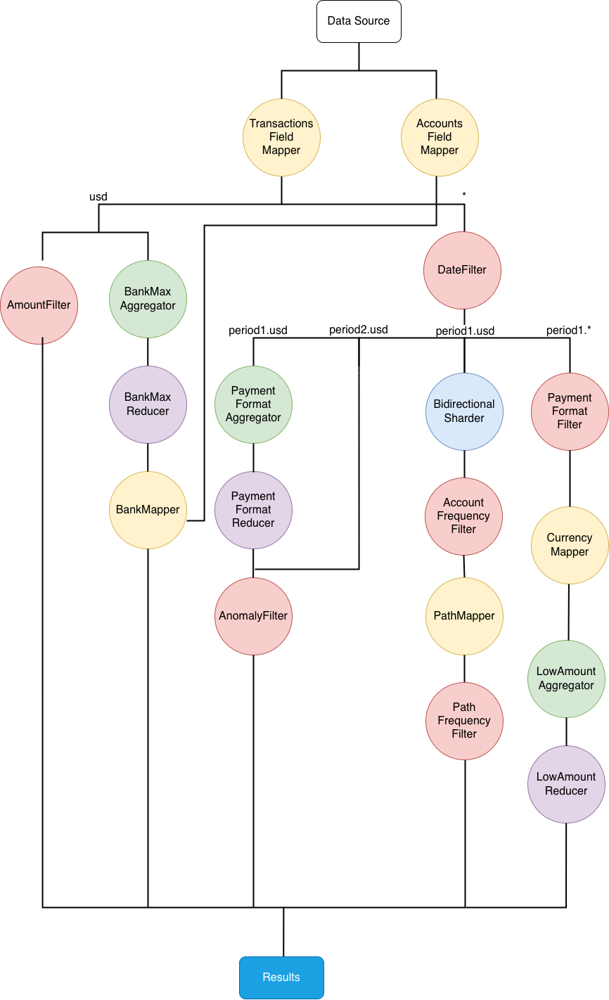

### Vista de Procesos

#### Diagramas de Actividades

A continuación se presentan los diagramas de actividad correspondientes a cada una de las cinco consultas. Cada diagrama modela el flujo de procesamiento y consolidación de resultados para su consulta, ilustrando cómo transitan los datos a través de la topología del sistema distribuido, pasando por distintas etapas de filtrado, ruteo, transformación y agregación, hasta la consolidación y el envío de los resultados finales.


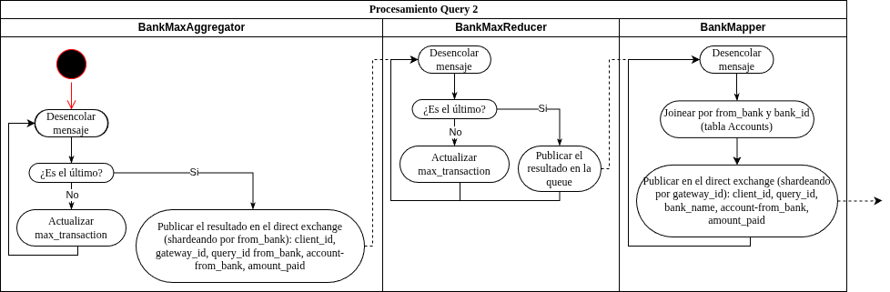

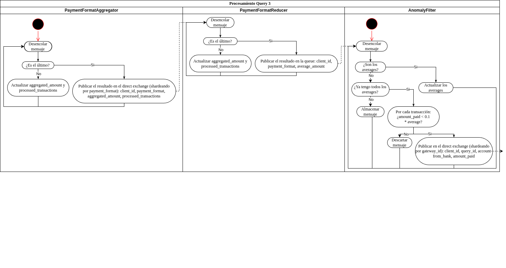

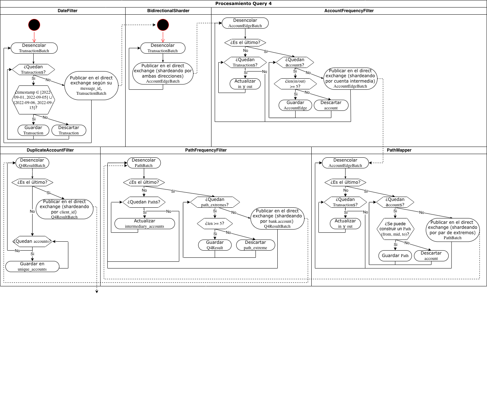

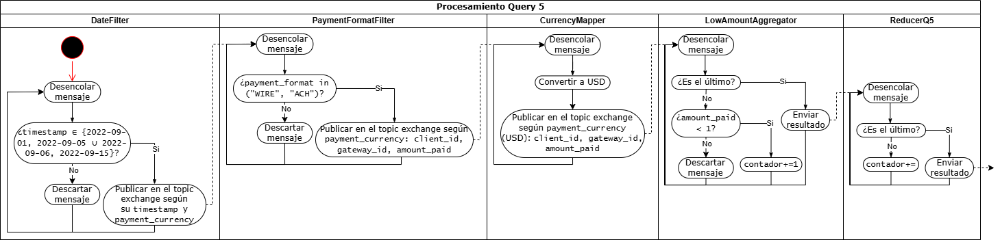

### Diagrama de Secuencia

El siguiente diagrama de secuencia expone la interacción general entre el cliente y los componentes de entrada y procesamiento del sistema distribuido. Se detalla el flujo de conexión inicial, donde el cliente envía una solicitud al `Proxy`, que se encarga de determinar el `Gateway` correspondiente y redirigir al cliente hacia él.

Una vez establecida la conexión con el `Gateway`, el cliente se anuncia enviando su `client_id`. Luego, procede a enviar los datos en *batches*: primero las transacciones, confirmadas con un `ack` y delegadas internamente hacia los `WorkersByQuery`, hasta señalizar el fin de su transmisión. Luego, de forma análoga, se envían los batches de cuentas, también delegados a los workers, finalizando con su señal de fin de transmisión correspondiente.

Una vez recibidas ambas señales, el sistema completa la etapa de procesamiento y consolidación, retornando los resultados calculados seguidos de la señal de cierre, que se propagan desde los `WorkersByQuery` a través del `Gateway` de vuelta hacia el cliente. Tanto los resultados como la señal de cierre son confirmados por el cliente a través de un `result_ack`.


### Vista de Desarrollo

#### Diagrama de Paquetes

El diagrama de paquetes muestra la organización modular de los componentes del sistema. 

En particular, el paquete **worker** representa de manera unificada a todos los nodos de procesamiento del pipeline (filtros, sharders, mappers, aggregators y reducers). Aunque cada uno tiene su lógica propia, todos comparten una misma estructura base (entrada desde el broker, procesamiento, salida al broker), por lo que se modelan como un único paquete para mantener el diagrama legible.

Esa estructura compartida vive en el paquete **common**, que agrupa las abstracciones reutilizables: la comunicación, los modelos de datos, la idempotencia, la persistencia, las abstracciones para el monitoreo de la salud del sistema y las clases base de los workers.

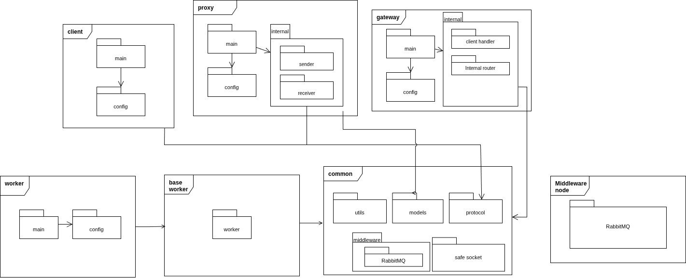

### Vista Física

#### Diagrama de Robustez

El diagrama que se encuentra a continuación muestra los componentes principales del sistema y sus interacciones. El `Client` se conecta primero al `Proxy`, que se encarga de indicarle a qué `Gateway` debe conectarse, ya que existen múltiples instancias disponibles. El `Proxy` cuenta con un único nodo que aplica *Round-Robin* para distribuir equitativamente los clientes entre los gateways.

Una vez que el `Client` obtiene el `Gateway` asignado, se conecta directamente a él y envía primero las transacciones en batches y luego las cuentas, también en batches. El `Gateway` distribuye estos datos a través de un exchange hacia los workers `TransactionsFieldMapper` y `AccountsFieldMapper`, encargados de normalizar los datos antes de enviarlos al resto del sistema.

Los nodos del sistema (filtros, aggregators, mappers, entre otros) se comunican entre sí a través de **exchanges y queues**, donde los exchanges permiten enrutar cada mensaje al nodo correspondiente según corresponda. Todos los nodos *stateful*, tanto los que reciben una única entrada como los de tipo *side input*, persisten su información en disco para poder reconstruir su estado y retomar el procesamiento ante una caída. Dentro de ellos, el `AnomalyFilter` y el `BankMapper` constituyen un caso particular: además de su estado, deben retener en disco las transacciones que llegan antes de contar con su segunda entrada. El `AnomalyFilter` las conserva mientras se calcula el promedio del período base necesario para la Query 3, y el `BankMapper` mientras espera la llegada de todas las cuentas para poder comenzar el mapeo de los nombres.

Finalmente, el último worker de cada query publica los resultados en una **cola por cliente**, que es consumida por el `Gateway` asignado a ese cliente. Los resultados se emiten de forma continua, a medida que se van generando, sin esperar a tener el resultado consolidado, y el `Gateway` los reenvía al `Client`.

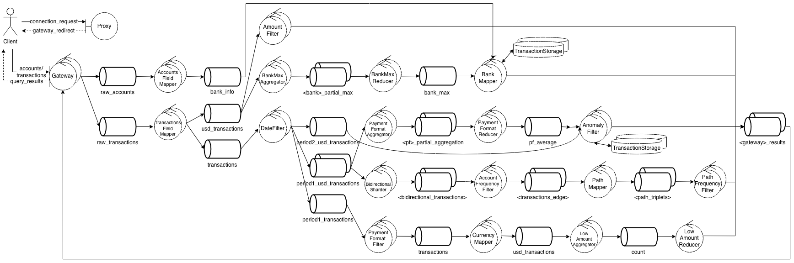

#### Diagrama de Despliegue

El diagrama de despliegue muestra cómo los distintos procesos del sistema se distribuyen en nodos de ejecución. Las líneas representan la comunicación entre nodos.

El sistema se organiza alrededor del **Broker Node** (RabbitMQ), que actúa como hub central de mensajería: todos los nodos de procesamiento se comunican entre sí exclusivamente a través de él. Las únicas conexiones por fuera del broker son las TCP entre el **Proxy Node** y el **Client PC**, y entre este último y los **Gateway Nodes**.

Los nodos de procesamiento se agrupan por rol funcional (**Filter Node**, **Sharder Node**, **Mapper Node**, **Aggregator Node**, **Reducer Node**). Cada uno de estos agrupamientos contiene múltiples implementaciones concretas con lógicas distintas (por ejemplo, el Filter Node engloba tanto el filtro por monto como el de fecha y el detector de anomalías). Se eligió agruparlos así para mantener el diagrama más simple y legible, evitando mostrar cada nodo individualmente.

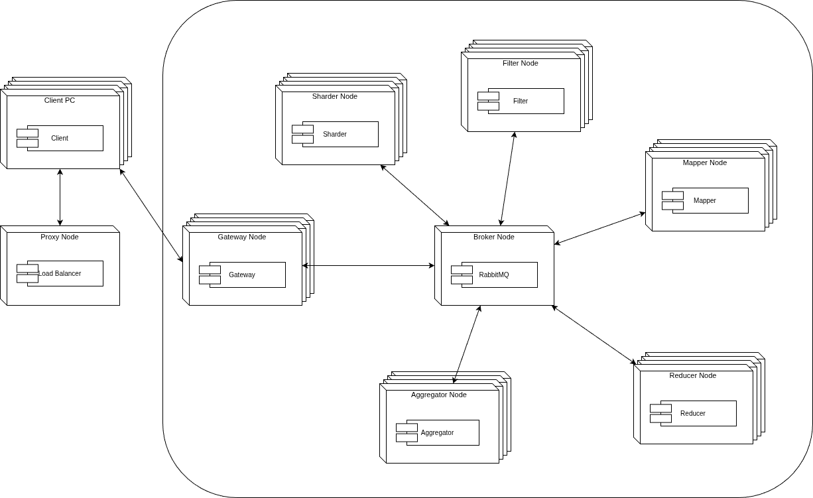

Los **Watchdog Nodes** se despliegan en sus propios nodos de ejecución, independientes del resto del sistema. Entre las instancias, la comunicación se realiza mediante **TCP** para la coordinación del algoritmo Bully. Con los nodos que monitorean, se utiliza **UDP** para el intercambio de mensajes de heartbeat (ping/pong).

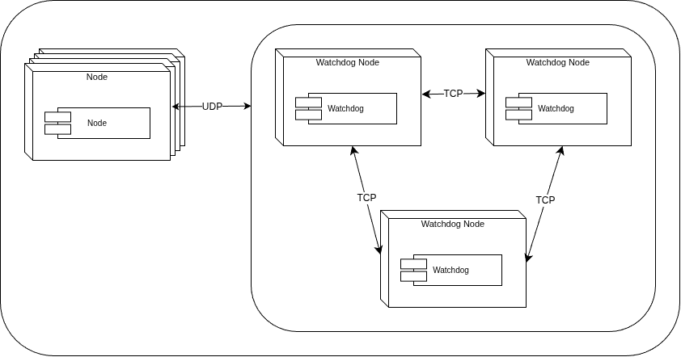

### Workers y manejo del end of file

Ante un EOF, un worker puede clasificarse en una de tres categorías principales según su comportamiento:

- `StatelessWorker` es trivial, al recibir un EOF simplemente lo reenvía al siguiente stage sin modificarlo. No necesita coordinarse con nadie porque su semántica de procesamiento es 1-a-1.
- `StatefulWorker` es el núcleo del sistema distribuido. Cuando llega un EOF, el nodo no lo reenvía directamente sino que lanza un mensaje `RING_EOF` que circula por un anillo lógico de nodos. Cada nodo acumula su `processed_count` al total del `RING_EOF` antes de reenviarlo; el primero en descubrir que el acumulado alcanza el `expected_count` del EOF original se auto-designa coordinador. A partir de ahí, el `RING_EOF` da una vuelta más para que todos los nodos ejecuten `_flush_data()` (vaciar buffers, emitir resultados pendientes). Cuando el mensaje vuelve al coordinador, éste emite el EOF final al siguiente stage. Como la cantidad de mensajes emitidos varía según el contenido (batching o sharding), cada nodo acumula su `sent_count` en el `RING_EOF` y el coordinador usa la suma total como `count` del EOF final.

    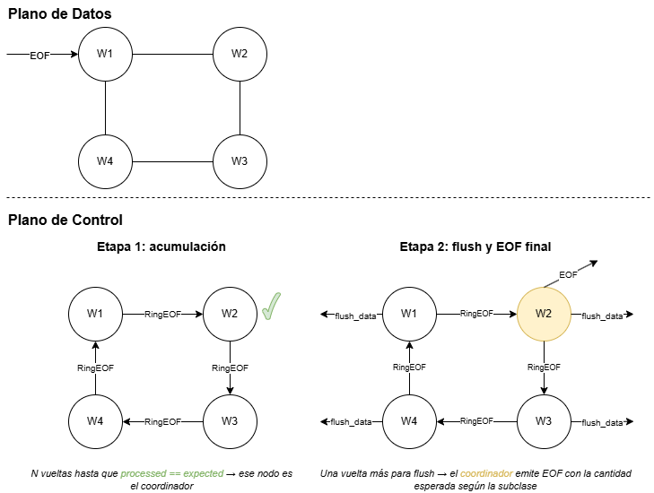

Como caso especial existe `SideInputStatelessWorker`, que extiende `StatelessWorker` e incorpora una segunda fuente de datos (side input) que debe estar completamente cargada antes de poder procesar el stream principal.

En el siguiente gráfico se ilustran los tipos de workers presentes en el pipeline:

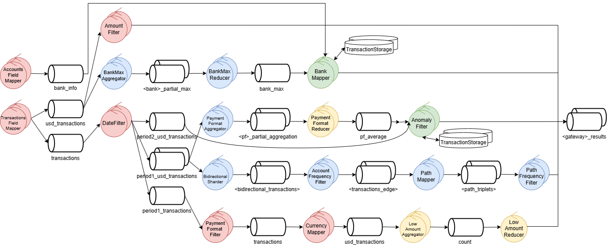

El color de cada nodo indica su categoría: rojo para `StatelessWorker`, azul para `StatefulWorker` y verde para `SideInputStatelessWorker`.

### Workers y el manejo de múltiples entradas

Dentro de las queries 2 y 3, tenemos dos workers que van a recibir información de dos fuentes al mismo tiempo. De parte de la query 2, el `BankMapper` va a recibir información para mapear el nombre del banco a partir del ID y también los máximos por cuenta de cada banco. Por parte de la query 3, el `AnomalyFilter` va a recibir por un lado el promedio de transacciones de cada medio de pago y también las transacciones a filtrar.

Ambos workers están implementados sobre `SideInputStatelessWorker` (los nodos verdes del diagrama anterior), la variante de `StatelessWorker` mencionada arriba que agrega el manejo de una segunda entrada.

Se implementó el `SideInputTracker`, el cual hace un seguimiento del side input: en nuestros casos, los promedios por formato de pago y la información de los bancos. Esta información se recibe por exchanges dedicados y cada réplica recibe su propio EOF de side input de forma independiente.

Es importante aclarar que el worker necesita de esta segunda entrada para poder procesar el stream principal, por lo que si recibe mensajes antes de que el side input esté completo, se guardan en disco para ser procesados posteriormente. Si el side input ya está listo, se procesan normalmente.

El spill (`BatchSpill`) almacena los batches por cliente de forma ordenada. Cuando `SideInputTracker` marca el flujo como `ready` se dispara `_on_side_input_ready`, que drena el spill y emite los resultados pendientes por el exchange.

## Tolerancia a Fallos

Como se observa en el diagrama, el sistema tolera la falla de todos los nodos excepto el *Proxy*, el cual suele implementarse como un servicio externo en arquitecturas de este tipo. Por otro lado, no se contempla la caída de *RabbitMQ*, ya que efectivamente se asume como un servicio externo gestionado fuera del alcance del sistema.

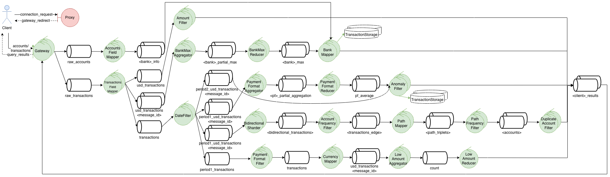

Por su parte, los nodos en verde deben ser capaces de reiniciarse automáticamente ante caídas, mientras que el cliente (coloreado en azul) no posee capacidad de auto-recuperación; sin embargo, su posible caída es igualmente contemplada dentro del diseño.

Para abordar la tolerancia a fallos, se consideraron tres aspectos fundamentales. En primer lugar, el reinicio automático de los nodos. No obstante, este mecanismo puede provocar el reenvío o reprocesamiento de mensajes, generando duplicados que impactan directamente en los resultados. Además, en el caso de los nodos *stateful*, es necesario garantizar la recuperación del estado para poder retomar la operación de manera consistente.

Por ello, se prestó especial atención a las siguientes soluciones:

* **Reinicio y disponibilidad:** se implementó un *Watchdog* encargado de detectar la caída de nodos y reiniciarlos automáticamente. Además, este componente se encuentra replicado para garantizar su disponibilidad y evitar que constituya un punto único de falla.
* **Idempotencia:** se diseñaron identificadores específicos para cada etapa del procesamiento y se incorporaron mecanismos de deduplicación en los nodos correspondientes.
* **Persistencia:** se utilizó un *Write-Ahead Log (WAL)* para garantizar la recuperación del estado y la persistencia de los datos ante fallos en nodos *stateful*.

Finalmente, un desafío adicional consistió en contemplar la caída tanto del *Gateway* como de los clientes. En estos casos, fue necesario diseñar mecanismos de reconexión y asegurar la eliminación de los datos que dejan de ser relevantes, evitando que información obsoleta permanezca propagándose a lo largo del *pipeline*.

### Reinicio – Watchdog

Con respecto al *Watchdog*, su función principal es detectar la caída de nodos y asegurar su reinicio. Para ello, se implementó un mecanismo de heartbeats basado en mensajes UDP, mediante el cual el *Watchdog* envía periódicamente pings a cada nodo. Si un nodo deja de responder luego de una determinada cantidad de reintentos, se lo considera caído y se procede a su reinicio mediante Docker in Docker.

Se eligió UDP debido a que la pérdida ocasional de mensajes no afecta el funcionamiento del sistema. Además, la utilización de reintentos permite evitar falsos positivos provocados por pérdidas esporádicas de paquetes.

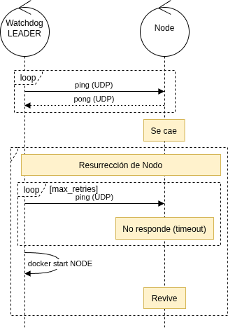

Por otro lado, para evitar que el *Watchdog* constituya un único punto de falla, se permite la existencia de múltiples instancias de este componente. Entre ellas se ejecuta el algoritmo de elección Bully, el cual garantiza que siempre exista un líder encargado de monitorear y reiniciar los nodos. La comunicación entre las distintas instancias se realiza mediante TCP, priorizando la confiabilidad y asegurando una correcta coordinación entre ellas.

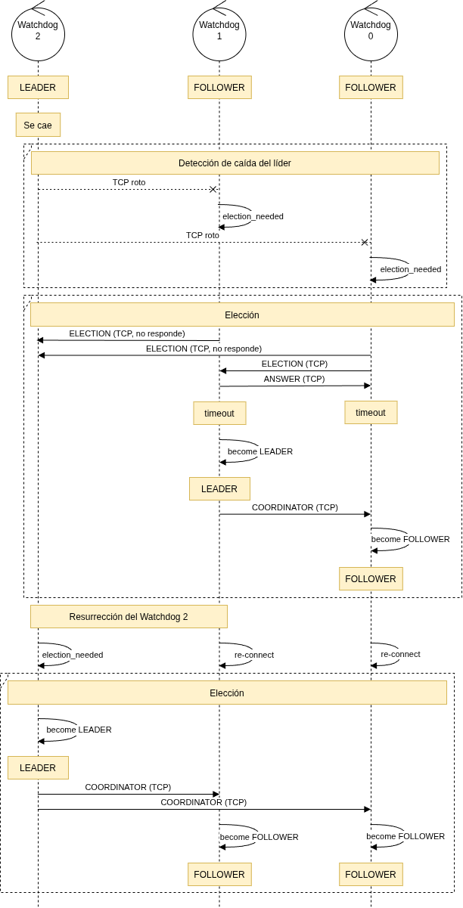

### Idempotencia

El sistema garantiza entrega *at-least-once*: cuando un worker cae antes de ackear un mensaje, RabbitMQ lo reentrega al revivir. Sin un mecanismo de deduplicación, esto provocaría que los resultados se procesen más de una vez y el output final tenga duplicados o valores incorrectos.

#### Mecanismo base

Cada worker mantiene un conjunto `seen` de IDs de mensajes ya procesados. Antes de procesar cualquier mensaje se verifica si su ID ya está en `seen`; si está, se descarta y se ackea sin volver a procesarlo. Si no está, se sigue el siguiente orden estricto:

```
dedup-check → procesar → seen.add → WAL → ack
```

El punto crítico es que nunca se ackea antes de persistir: si el proceso muere entre el fsync y el ack, RabbitMQ reentrega el mensaje y el ID ya está en `seen`, por lo que se descarta correctamente.

#### IDs deterministas

Para que la deduplicación funcione tras una caída, los IDs de los mensajes re-emitidos deben ser **exactamente los mismos** que los originales. Si se generaran aleatoriamente, al re-emitir tras una caída el downstream recibiría IDs nuevos que no reconocería como duplicados. Por eso todos los IDs se deben calcular de forma determinística.

A su vez, se emplea una entrega determinística a partir del ID del mensaje, evitando la posibilidad de que un mismo mensaje llegue a distintas réplicas, y se cuente un dato de forma duplicada. Esto podría ocurrir ya que cada réplica tiene un `seen` propio. 

#### Tipos de IDs

El esquema varía según el tipo de nodo que emite:

- **Root** (`client_id:batch_index`): lo agrega el gateway al recibir cada batch del cliente. Es el origen de la cadena de IDs.

- **Pass-through**: mappers, filters y sharders pasan el ID de entrada sin modificarlo.

- **Flush** (`client_id:origen:n_batch`): lo genera un aggregator o reducer al flushear su estado acumulado. En este punto ya no hay un único mensaje padre del cual derivar el ID (el nodo mergeó muchos inputs), así que se arma uno nuevo a partir del `node_id` del nodo, y un discriminador `n_batch` secuencial. 

- **Ring** (`client_id:fase:seq`): identifica los tokens de control que circulan por el anillo de coordinación de fin de flujo, con `fase` (`count`, `flush`, `cleanup`). Cada nodo incrementa el `seq` del token, de modo que una reentrega del mismo token tiene el mismo ID y se descarta. Cuando cambia de fase se reinicia el `seq`. 

- **EOF / QUERY_END** (`client_id:eof` o `client_id:eof:query_id`): se emiten al finalizar un flujo. No lleva el `node_id` del coordinador: si tras un crash coordina un nodo distinto, el downstream debe reconocer el EOF como el mismo mensaje y descartarlo, lo que sería imposible si el ID dependiera de quién coordinó.

- **EOF Cleanup** (`client_id:eof:cleanup`): se emite cuando el Reaper detecta que un cliente se desconectó y venció el timeout. Se agrega `cleanup` para distinguirlo del EOF corriente, y no se produzcan deduplicaciones incorrectas. 

#### Deduplicación en el cliente

El cliente deduplica los resultados en memoria usando como clave `(query_id, message_id)`. El `query_id` es necesario porque los IDs pueden colisionar entre queries.

### Persistencia – WAL

Dado que el estado de los nodos *stateful* vive en memoria, una caída haría que se pierda toda la información. Al reiniciarse, el nodo recibiría los mensajes no ackeados por RabbitMQ pero no tendría el estado previo para procesarlos correctamente. Para resolverlo, se persistió el estado usando un *Write-Ahead Log (WAL)*: en lugar de guardar una copia completa del estado ante cada mensaje, se appendea únicamente el *delta* que ese mensaje aporta. El estado completo se reconstruye al arrancar reproduciendo los deltas sobre el estado inicial.

Cada réplica mantiene un único archivo de log en un volumen Docker persistente. Antes de ackear cada mensaje, el worker escribe en el **WAL** el identificador del mensaje y su delta, garantizando que si el proceso muere antes del ack, al revivir el mensaje sea reentregado pero ya figure en el log y sea descartado por el mecanismo de deduplicación.

Para que el **WAL** no crezca indefinidamente se **compacta** periódicamente: se reemplaza por un snapshot del estado actual, de modo que el replay al reiniciar es siempre acotado. La compactación ocurre siempre al iniciar y cada cierta cantidad de operaciones durante la ejecución normal.

Al arrancar, el worker reproduce el log: restaura el estado y reconstruye el conjunto de mensajes ya vistos. Luego RabbitMQ reentrega los mensajes sin ackear, que el mecanismo de deduplicación descarta si ya fueron procesados. De este modo, el nodo retoma exactamente donde estaba sin duplicar ni perder resultados.

### Manejo de caídas del Gateway y el cliente

Finalmente, en cuanto a la caída del *Gateway* y el cliente, se distinguen tres escenarios posibles:

* **Caída del Gateway:** en este caso, el cliente implementa un mecanismo de reintentos con backoff exponencial, dado que se asume que el *Gateway* eventualmente se recupera, permitiendo restablecer la conexión y continuar la operación.
* **Caída del cliente:** ante este escenario, el *Gateway* detecta la desconexión y procede a iniciar la limpieza de los datos a lo largo del *pipeline*.
* **Caída simultánea del cliente y el Gateway:** en este caso puede no realizarse la limpieza correspondiente de manera inmediata. Para mitigar esta situación, se implementa en el *Gateway* un *reaper*, encargado de detectar timeouts de interacción con el cliente y ejecutar la limpieza pendiente de forma diferida.

### Testing – Chaos Monkey

Para verificar el correcto funcionamiento de la solución, se implementó un *Chaos Monkey* encargado de provocar fallas de manera controlada. Este mecanismo elimina aleatoriamente una cierta cantidad de nodos (aquellos coloreados en verde) a intervalos regulares. Adicionalmente, permite forzar la caída de todos los nodos o de un nodo específico, lo cual resulta útil para validar escenarios particulares. Asimismo, permite la incorporación dinámica de clientes, posibilitando evaluar el comportamiento del sistema ante variaciones en la carga y en la cantidad de clientes activos.

## Mediciones de tiempos

Mediante este mecanismo de inyección de fallas se midió el tiempo total de procesamiento de extremo a extremo, desde el inicio de la transmisión del cliente hasta la recepción de los resultados de las cinco queries, para cada tamaño de dataset, tanto con como sin la inyección de fallos por parte del *Chaos Monkey*.

| Dataset | Sin *Chaos Monkey* | Con *Chaos Monkey* |
|---|---|---|
| Small | 35 s | 35 s |
| Medium | 215 s | 216 s |
| Large | 1035 s | 1059 s |

Para la medición con *Chaos Monkey, se expuso al sistema a la caída continua de workers: cada **30 segundos** se mataban **3 nodos aleatorios**, excluyendo del conjunto de víctimas a los clientes, los gateways y garantizando que al menos un `Watchdog` permaneciera activo. Los gateways se incluyeron entre los nodos protegidos para que la prueba fuera justa, ya que su caída introduce una demora significativamente mayor que la de los demás workers. Finalmente, se verificó la correctitud de los resultados obtenidos.

## División de tareas

| Tarea | Integrante |
|---|---|
| Query 1 | Luciana |
| Query 2 | Bautista |
| Query 3 | Bautista |
| Query 4 | Carolina |
| Query 5 | Carolina |
| Middleware | Bautista |
| Server | Luciana |
| Cliente | Luciana |
| Idempotencia | Luciana y Bautista |
| Persistencia | Luciana y Bautista |
| Watchdog | Carolina |
| Manejo de caídas del Cliente y el Gateway | Luciana, Carolina y Bautista |
| Chaos Monkey | Carolina |
